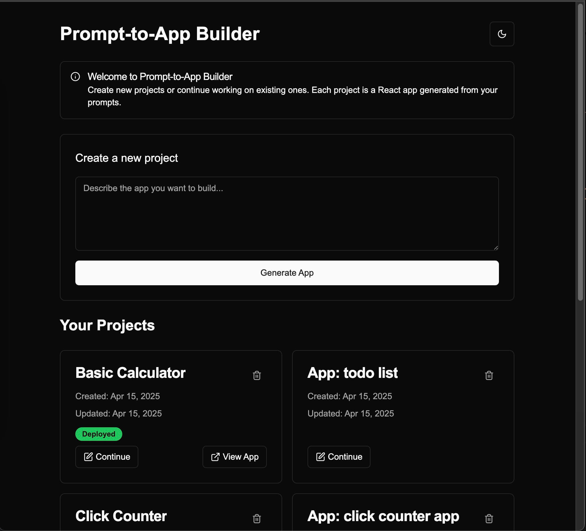

# Text-to-app Project

> **Caveat:** This project was 95% "vibe-coded" using v0+cursor and does not necessarily represent my personal coding style, architecture, or production-level standards.

A simple app that allows you to generate a single file React app from a text prompt.

## How to run locally

- run `pnpm install` to install the dependencies
- create a .env.local file in the root of the project, based on the .env.example file
- run `pnpm dev` to start the development server

## Out of scope

- generating **multi-file apps** - only a single `app.tsx` file is supported
- adding **extra dependencies** to the app
- **database connection** to persist user projects - the app uses browser's local storage
- **streaming LLM responses** to the UI
- **versioning** of the app - currently only the last version of the app is kept
- **code editing** - code preview is read-only
- **responsive design** - the app is not mobile-responsive

## Known issues

- AI chat's memory is not set-up yet, so LLM does not know the context of the conversation. Each message is evaluated as an `init request` _(if there is no generated code yet)_ or an `edit request`.
- AI responses are not human-friendly.

## Example initial prompts

- Works:
  - `simple todo app`
  - `click counter`
    - edit suggestion: `now make the button red`
  - `calculator`
- Gets rejected:
  - `video streaming platform`
  - `how are you?`
  - `credit-card fraud website`

## Screenshots

